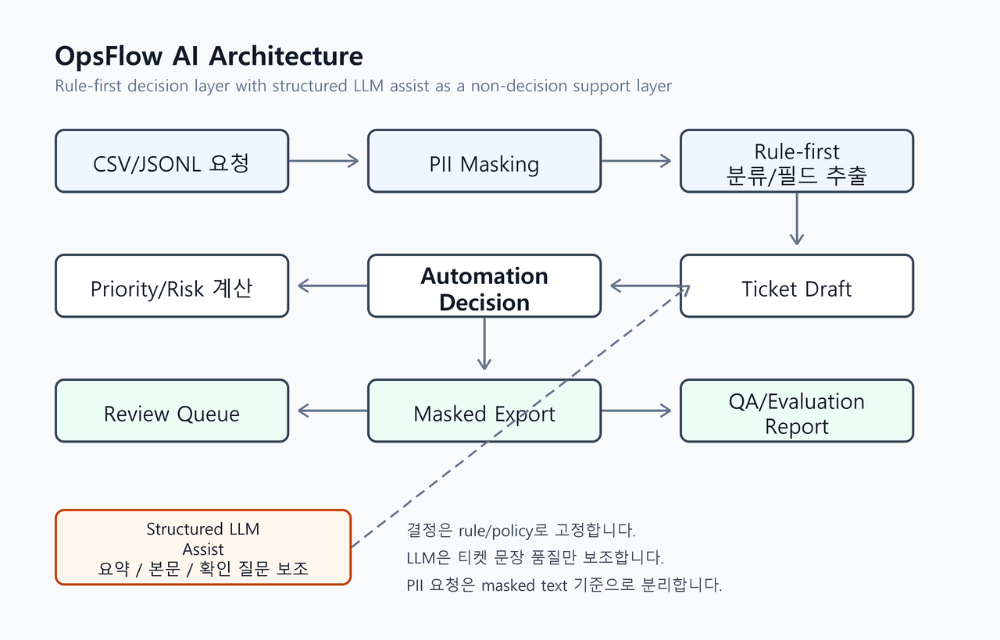

# OpsFlow AI 포트폴리오 보고서

작성자: 임창현
진행 형태: 개인 프로젝트
진행 시기: 2026.05
작성일: 2026-05-11

한 줄로 요약하면, OpsFlow AI는 흩어진 업무 요청을 사람이 검토 가능한 티켓 초안과 review queue로 바꾸는 CLI 파이프라인입니다. 분류, 정보 추출, 개인정보 마스킹, 자동화 판단, LLM 보조, human eval까지 직접 설계하고 구현했습니다.

## Key Achievements

- False automation rate 0.0%, review recall 100.0%를 달성해 위험한 요청을 자동화 후보로 놓치지 않는 보수적 경계를 구현했습니다.
- 자동화 결정은 규칙으로 고정하고, LLM은 문장 품질을 높이는 보조 계층으로 분리해 설명 가능성과 자연스러움을 함께 확보했습니다.
- `review_required` 요청에도 티켓 초안을 생성하되, 외부 등록 후보는 dry-run payload에서 분리해 human-in-the-loop 흐름을 보강했습니다.
- 실제 human eval 피드백을 반영해 내부 필드명, 판단 근거, 확인 질문을 사람이 읽는 문장으로 개선했습니다.
- PII 감지 요청은 LLM 입력과 외부 공유 산출물에서 masked text 기준으로 처리하도록 안전 경계를 분리했습니다.

## 1. 문제 정의

업무 요청은 자주 비정형으로 들어옵니다. 누군가는 Slack에 "결제 안 됩니다"라고 남기고, 누군가는 "지난번 데이터 다시 주세요"라고 말합니다. 어떤 요청은 고객지원처럼 보이지만 실제로는 엔지니어링 확인이 필요하고, 어떤 요청은 단순 문의처럼 보여도 환불, 권한, 개인정보처럼 바로 자동화하면 위험한 요소를 포함합니다.

이런 요청을 사람이 매번 읽고, 분류하고, 필요한 정보를 다시 묻고, 티켓으로 옮기는 과정은 반복적입니다. 하지만 완전히 자동화하기에는 위험합니다. 정보가 부족한 요청을 성급하게 등록하면 담당자가 다시 해석해야 하고, 개인정보가 포함된 요청을 그대로 외부 시스템에 넘기면 보안 문제가 됩니다.

그래서 이 프로젝트의 핵심 질문은 단순한 자동 티켓 생성이 아니었습니다.

업무 요청을 자동으로 정리하되, 어디까지 자동화하고 어디서 사람에게 넘겨야 하는지를 설명 가능한 형태로 만들 수 있을까?

## 2. 설계 목표와 어려웠던 점

목표는 "AI가 알아서 티켓을 만들어 주는 도구"가 아니라, 운영자가 판단하기 쉬운 업무 정리 파이프라인이었습니다.

이를 위해 세 가지 기준을 세웠습니다.

1. 짧고 애매한 요청도 표준 스키마로 정리한다.
2. 자동화해도 되는 요청과 사람 검토가 필요한 요청을 분리한다.
3. 외부 공유 가능한 masked export와 내부 검토용 원본 산출물을 분리한다.

실제로 어려웠던 부분은 짧은 요청, 다의적 키워드, 개인정보와 고위험 조치였습니다. "결제 안 됩니다"는 증상은 있지만 고객, 영향 범위, 재현 조건이 없습니다. "결재 승인 플로우에서 500 에러가 납니다"는 승인이라는 단어를 포함하지만 실제 의미는 승인 요청이 아니라 버그입니다. 전화번호, 주문번호, 사람 이름, 권한 부여, 환불, 결제 취소 같은 요청은 자동화 편의보다 안전 경계가 더 중요했습니다.

초기 구현에서 가장 크게 드러난 문제는 사람에게 보이는 문장이었습니다. 내부적으로는 `dataset_or_metric`, `impact_scope`, `low_confidence` 같은 키가 명확하지만, 평가자 입장에서는 코드값처럼 보였습니다. 최종 단계에서는 이 문제를 해결하기 위해 사람용 설명 계층을 별도로 추가했습니다.

## 3. 아키텍처

OpsFlow AI는 하나의 모델 호출 결과에 의존하지 않습니다. 먼저 rule-first 파이프라인으로 재현 가능한 판단을 만들고, LLM assist는 요약과 확인 질문을 보조하는 계층으로 제한했습니다.



이 구조를 선택한 이유는 운영 자동화에서 "왜 이 요청이 review_required인지", "어떤 개인정보가 마스킹됐는지", "외부 등록 후보에 들어가도 되는지"가 항상 설명 가능해야 하기 때문입니다. 그래서 결정 계층은 rule과 policy로 고정하고, LLM assist는 본문 품질을 높이는 보조 계층으로만 사용했습니다.

### 3-1. Schema / Contract

`RawRequest`, `NormalizedRequest`, `TicketDraft`, `ReviewQueueItem`, `ExecutionTrace`를 Pydantic 모델로 고정했습니다. 예를 들어 `ready_for_approval`인데 필수 누락 필드가 남아 있으면 schema validator에서 실패하도록 했습니다.

### 3-2. Rule Engine / Decision

요청 유형, 담당 팀, 우선순위, 위험도는 config 기반 rule로 계산했습니다. 자동화 판단은 `reject`, `review_required`, `draft_only`, `ready_for_approval` 순서로 적용했습니다. 정책상 차단해야 할 요청과 사람 검토가 필요한 요청을 먼저 걸러야 자동 승인 후보가 안전하게 남기 때문입니다.

### 3-3. Privacy / Masked Export

PII 감지 시 LLM에는 원문 대신 masked text를 전달합니다. 또한 외부 공유용 산출물은 `masked_normalized_requests.json`, `masked_review_queue.csv`로 분리했습니다. 원본 review queue는 내부 확인에 필요하지만, 포트폴리오나 외부 리뷰에서는 masked export를 사용해야 안전합니다.

### 3-4. Ticket Draft / Review Queue

처음에는 `ready_for_approval`, `draft_only` 요청에만 티켓 초안을 만들었습니다. 하지만 human-in-the-loop 관점에서는 오히려 `review_required` 요청에 초안이 더 필요했습니다. 최종 구현에서는 review_required도 `ticket_drafts.json`에 포함했고, GitHub dry-run payload는 승인 가능한 draft 계열로 제한했습니다.

### 3-5. LLM Assist

LLM assist는 기본 비활성화입니다. `--enable-llm-assist`와 `OPENAI_API_KEY`가 있을 때만 실행됩니다. 응답은 자유 형식이 아니라 structured JSON schema로 받습니다. 다만 LLM assist는 분류, 라우팅, 자동화 결정을 바꾸지 않습니다.

## 4. 실제 구현과 검증

최종 구현 범위는 네 축으로 정리할 수 있습니다.

| 축 | 구현한 내용 |
| --- | --- |
| Normalization Pipeline | CSV/JSONL 로딩, PII masking, rule-first 분류, 필드 추출, 우선순위/위험도 계산 |
| Automation Decision / Review | `reject`, `review_required`, `draft_only`, `ready_for_approval` 판단과 review queue 생성 |
| Ticket / Export / Trace | 티켓 초안, GitHub dry-run payload, execution log, QA assertion report, evaluation report, masked export 생성 |
| Human Eval / Follow-up | A/B 평가 HTML, 실제 평가 CSV 반영, 내부 필드명과 판단 근거 표시 개선 |

최종 검증 명령:

```powershell
pytest -q
ruff check .
python -m src.main run --input data/sample_requests.csv --config config --output outputs/final_improvement_check_2026-05-11 --gold data/labeled_requests.csv --dry-run
```

최종 결과:

```text
pytest: 73 passed
ruff: all checks passed
sample pipeline: 30 requests processed
QA assertion: 240 passed, 0 failed
```

대표 산출물 예시:

```text
REQ-013 결제 취소 요청

누락 정보
- 처리 범위/금액: 승인 범위, 금액, 수량, 처리 대상
- 승인권자: 처리를 승인할 책임자나 팀

확인 질문
결제 취소/환불 처리 가능 여부를 판단할 수 있도록 승인권자, 적용 정책 또는 처리 범위/금액을 알려 주세요.
```

## 5. 지표와 해석

최종 샘플 지표는 아래와 같습니다.

| metric | value |
| --- | ---: |
| request_type_accuracy | 100.0% |
| target_team_accuracy | 100.0% |
| priority_accuracy | 100.0% |
| risk_level_accuracy | 100.0% |
| decision_accuracy | 76.7% |
| missing_fields_exact_match | 80.0% |
| automation_coverage | 33.3% |
| false_automation_rate | 0.0% |
| over_automation_rate | 14.3% |
| review_recall | 100.0% |
| review_precision | 80.0% |

이 MVP에서 가장 중요하게 본 지표는 false automation rate 0.0%와 review recall 100.0%입니다. 업무 자동화에서는 자동화 범위를 넓히는 것보다 위험한 요청을 자동화 후보로 놓치지 않는 것이 먼저라고 판단했습니다.

decision_accuracy 76.7%와 over_automation_rate 14.3%는 아직 개선 여지가 있다는 뜻입니다. 다만 이 프로젝트의 정책은 자동 승인보다 review 쪽으로 기울어져 있습니다. 일부 요청을 더 많이 review로 보내는 보수 편향은 의도적인 선택이었고, 그 결과 false automation 0.0%를 유지할 수 있었습니다.

`missing_fields_exact_match`는 gold label에 적힌 누락 필드 집합과 모델이 산출한 누락 필드 집합이 정확히 같은 비율입니다. 80.0%는 필수 정보 감지는 대체로 안정적이지만, approval_request처럼 업무 정책에 따라 누락 기준이 달라질 수 있는 영역은 추가 튜닝 여지가 남아 있다는 뜻으로 해석했습니다.

## 6. 판단을 바꾼 지점

이 프로젝트에서 중요한 것은 기능을 하나씩 추가한 것보다, 검증하면서 기준을 바꿔 간 과정이었습니다.

### 6-1. Review 대상에도 초안이 필요했습니다

처음에는 review_required 요청은 review queue에만 남기면 된다고 생각했습니다. 실제로는 검토자가 가장 오래 걸리는 구간이 애매한 요청을 처음부터 다시 정리하는 일이었습니다. 그래서 review_required도 티켓 초안을 만들도록 바꿨고, 외부 등록 후보와는 분리했습니다.

### 6-2. LLM 응답은 자연스러워도 구조화가 필요했습니다

LLM assist를 붙이면 제목과 요약은 자연스러워졌습니다. 하지만 자유 형식 응답은 검증하기 어렵습니다. 그래서 structured JSON schema 응답으로 바꿨습니다. LLM이 만든 문장을 쓰더라도 어떤 필드를 채웠는지, 실패하면 어디서 fallback 되는지 추적 가능해야 한다고 판단했습니다.

### 6-3. Human eval은 점수보다 메모가 더 중요했습니다

사람 평가에서 rule-only와 LLM-assist 평균 점수는 거의 같았습니다. 하지만 메모를 보면 실제 개선 지점이 뚜렷했습니다. `impact_scope`가 무엇인지 모르겠다, `low_confidence`가 왜 판단 근거인지 모르겠다, 결제 취소 요청에 마감일을 묻는 것은 어색하다는 피드백이 나왔습니다.

이 피드백을 반영해 `src/human_text.py`를 추가하고, 티켓 초안과 review queue에 사람이 읽는 설명 계층을 넣었습니다. 결과적으로 프로젝트는 단순히 동작하는 파이프라인에서, 사람이 검토할 수 있는 파이프라인으로 바뀌었습니다.

### 6-4. 키워드보다 업무 의미를 봐야 했습니다

`REQ-028`은 "결재 승인 플로우에서 500 에러"라는 요청입니다. 승인이라는 단어 때문에 approval_request 후보가 섞였지만, 실제 업무 의미는 명확한 버그였습니다. 이 케이스를 계기로 engineering 팀 키워드와 판단 근거 표시를 보강했고, 최종적으로 `ready_for_approval`로 처리되도록 개선했습니다.

## 7. Human Eval 이후 달라진 결과

| request_id | 개선 전 문제 | 개선 후 |
| --- | --- | --- |
| REQ-002 | 요약이 원문 반복에 가까움 | 이전 데이터 재요청이며 데이터 대상과 목적 확인이 필요하다고 요약 |
| REQ-003 | `impact_scope`가 그대로 노출됨 | `영향 범위`와 설명, 구체 질문으로 표시 |
| REQ-013 | 결제 취소 요청에 마감일을 질문함 | 승인권자, 정책, 처리 범위/금액 확인 질문으로 변경 |
| REQ-017 | 조치 의도가 명확한데 `required_action`을 다시 물음 | `문제 원인 확인 및 고객 응대`로 추론 |
| REQ-028 | `low_confidence` 이유를 이해하기 어려움 | bug로 안정 분류되어 `ready_for_approval` 처리 |

최종 검증 산출물은 아래 경로에 남겼습니다.

```text
outputs/final_improvement_check_2026-05-11
```

이 폴더에는 QA assertion 240건 통과 결과, `evaluation_report.md`, `github_dry_run.json`, `ticket_drafts.json`, masked export가 포함되어 있습니다.

## 8. 다음 단계

현재 제출 범위는 OpsFlow AI MVP v1입니다. 다음 단계는 아래 우선순위로 보는 것이 적절합니다.

| priority | 과제 | 예상 임팩트 |
| --- | --- | --- |
| P1 | reviewer workflow / 승인 UI | CSV와 HTML 평가 도구를 실제 운영 승인 흐름으로 확장 |
| P2 | 개인정보 위험 등급 세분화 | 전화번호, 주문번호, 사람 이름, 환불/결제 취소를 같은 강도로 다루는 보수 정책을 운영 친화적으로 조정 |
| P3 | per-request latency, token usage, cost estimate 리포트 | LLM assist를 실제 운영 의사결정에 넣기 위한 비용/속도 근거 확보 |
| P4 | 더 큰 외부 seed 평가 | synthetic 중심 샘플을 넘어 rule-freeze 이후 일반화 성능 확인 |
| P5 | 실제 외부 시스템 생성 연동 | dry-run payload를 승인 UI와 연결한 뒤 GitHub/Jira 생성까지 확장 |

현재 OpsFlow AI는 완성된 운영 제품이라기보다, 업무 요청 자동화의 안전한 MVP 경계를 코드와 산출물로 증명한 1차 검증 프로젝트입니다.

## 9. 부록

### 9-1. 핵심 기술 스택

| 범주 | 사용 기술 | 이 프로젝트에서 맡은 역할 |
| --- | --- | --- |
| 언어 | Python | CLI, rule engine, evaluation, tests 구현 |
| 데이터 모델 | Pydantic v2 | 요청/응답/trace/schema contract 검증 |
| 설정 | YAML | request type, required field, risk, privacy, ticket template 정책 관리 |
| 테스트 | pytest | schema, decision, privacy, ticket, review queue 회귀 테스트 |
| 정적 검사 | ruff | 코드 품질 점검 |
| LLM | OpenAI Chat Completions structured response | 요약, 제목, 본문, 확인 질문 보조 |
| 산출물 | JSON, CSV, Markdown, HTML | normalized output, review queue, reports, human eval form 생성 |

### 9-2. 대표 구현 파일

```text
src/main.py
src/normalizer.py
src/rule_engine.py
src/decision.py
src/ticket_builder.py
src/review_queue.py
src/llm_assist.py
src/privacy.py
src/human_text.py
```

자세한 검증 문서와 산출물 목록은 `README.md`의 추가 검증 문서 섹션에 정리했습니다.

### 9-3. AI 도구 활용 메모

구현과 검증 과정에서는 Codex와 LLM assist를 보조 도구로 활용했습니다. 설계 대안 정리, 코드 수정, human eval HTML 개선, 평가 결과 문서화에 도움을 받았지만, 자동화 경계, 보안 판단, 최종 해석은 프로젝트 기준에 맞춰 직접 검토했습니다.

## 10. 맺음말

OpsFlow AI로 보여 주고 싶었던 것은 "AI로 티켓을 자동 생성했다"는 단순한 결과가 아닙니다.

이 프로젝트는 자동화 정확도만 높이는 작업이 아니라, 자동화하지 말아야 할 요청을 놓치지 않는 안전 경계를 코드와 평가 결과로 증명한 작업입니다.

처음에는 기능이 동작하는 MVP를 목표로 했지만, human eval을 거치면서 중요한 기준이 바뀌었습니다. 사람이 이해하기 어려운 자동화 결과는 실제 업무에 들어가기 어렵습니다. 그래서 최종 단계에서는 내부 키를 그대로 보여 주는 대신, 평가자와 담당자가 바로 읽을 수 있는 누락 정보, 판단 근거, 확인 질문으로 바꿨습니다.

현재 OpsFlow AI는 기능 구현 MVP를 넘어 검토자가 바로 수정할 수 있는 업무 큐까지 도달했습니다. 다음 단계에서는 reviewer workflow, 개인정보 위험 등급, 비용/지연 시간 측정, 외부 seed 평가를 붙여 운영형 프로젝트로 확장할 수 있습니다.
